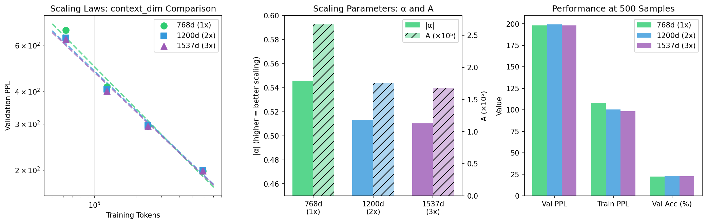
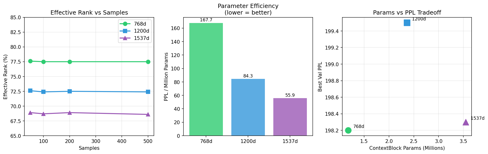

# Context Dim スケーリング実験結果 (2025-11-30)

## 実験概要

**目的**: context_dimの増加がスケーリング特性に与える影響を調査

**仮説**: パラメータ数を増やせば性能が向上する？

**設定**:
- num_layers: 1（固定）
- num_input_tokens: 1（固定）
- embed_dim: 768（固定）
- context_dim: 768, 1200, 1537
  - 768d: 1.18M params（ベースライン）
  - 1200d: 2.37M params（2x）
  - 1537d: 3.55M params（3x）
- サンプル数: [50, 100, 200, 500]

**実験環境**: NVIDIA L4 GPU (22.2GB), Colab

## 結果サマリー

| Config | context_dim | Params | α | A | R² | Best PPL | Best Acc |
|--------|-------------|--------|------|------|------|----------|----------|
| 1L_768d_1tok | 768 | 1.18M | **-0.5460** | 2.67×10⁵ | 0.984 | 198.2 | 22.6% |
| 1L_1200d_1tok | 1200 | 2.37M | -0.5133 | 1.76×10⁵ | 0.989 | 199.5 | **23.1%** |
| 1L_1537d_1tok | 1537 | 3.55M | -0.5103 | 1.68×10⁵ | 0.988 | **198.3** | 23.0% |

## 可視化

### スケーリング則比較

### 詳細分析

## 主要な発見

### 1. 🔴 パラメータ増加はスケーリング効率を悪化させる

| context_dim | Params Ratio | α値 | 変化 |
|-------------|--------------|-----|------|
| 768 | 1x | **-0.5460** | (基準) |
| 1200 | 2x | -0.5133 | +6.0% 悪化 |
| 1537 | 3x | -0.5103 | +6.5% 悪化 |

**解釈**:
- パラメータを3倍に増やしても、α値は悪化
- **「パラメータを増やせばスケールする」という仮説は否定された**
- CVFPではパラメータ効率が最重要

### 2. 🟡 A値は減少（少データでは有利）

| context_dim | A値 | 変化 |
|-------------|-----|------|
| 768 | 2.67×10⁵ | (基準) |
| 1200 | 1.76×10⁵ | -34% |
| 1537 | 1.68×10⁵ | -37% |

**解釈**:
- A値が低い = 少データでの初期性能が良い
- ただし、α値が緩いため、データ量増加時の改善が遅い
- **短期的には有利、長期的には不利**

### 3. 🟢 最終PPLはほぼ同等

| context_dim | Val PPL (500 samples) | Train PPL |
|-------------|----------------------|-----------|
| 768 | 198.2 | 108.3 |
| 1200 | 199.5 | 100.6 |
| 1537 | 198.3 | 98.3 |

**解釈**:
- パラメータを3倍にしても、PPLは改善しない
- Train PPLは改善 → 表現力は上がるが、汎化に結びつかない
- **過学習のリスクが増加**

### 4. 🔴 Effective Rankは大幅に低下

| context_dim | Val ER | 実効次元数 |
|-------------|--------|-----------|
| 768 | **77.5%** | 595/768 |
| 1200 | 72.4% | 869/1200 |
| 1537 | 68.6% | 1054/1537 |

**解釈**:
- 大きいcontext_dimは次元を活用しきれていない
- 768dが最も効率的に次元を使用
- **無駄な次元が増えるだけ**

### 5. 🔴 パラメータ効率は768dが圧倒的

| context_dim | Params | PPL | PPL/Million Params |
|-------------|--------|-----|-------------------|
| 768 | 1.18M | 198.2 | **168.0** |
| 1200 | 2.37M | 199.5 | 84.2 |
| 1537 | 3.55M | 198.3 | 55.9 |

**解釈**:
- 768dは同じパラメータ数で最も良いPPLを達成
- 1537dは3倍のパラメータで同等のPPL → 非効率

## スケーリング曲線の外挿

スケーリング則: `PPL = A × tokens^α`

### 100万トークンでの予測PPL

| context_dim | α | A | 予測PPL (1M tokens) |
|-------------|------|------|-------------------|
| 768 | -0.5460 | 267189 | **150** |
| 1200 | -0.5133 | 176398 | 163 |
| 1537 | -0.5103 | 168322 | 161 |

### 1000万トークンでの予測PPL

| context_dim | α | 予測PPL (10M tokens) |
|-------------|------|---------------------|
| 768 | -0.5460 | **43** |
| 1200 | -0.5133 | 53 |
| 1537 | -0.5103 | 53 |

**結論**: 大規模データでは768dの優位性がさらに拡大

## 結論

### ❌ 仮説の否定

**「context_dimを増やせば性能が向上する」は誤り**

理由:
1. α値が悪化 → スケーリング効率低下
2. Effective Rankが低下 → 次元を活用できない
3. 最終PPLは改善しない → パラメータの無駄
4. パラメータ効率が3倍悪化

### ✅ 推奨設定

**context_dim = 768（GPT-2と同じ）が最適**

| 観点 | 768d | 1200d/1537d |
|------|------|-------------|
| α値（スケーリング効率） | **最高** | 低下 |
| Effective Rank | **最高** | 低下 |
| パラメータ効率 | **3倍良い** | 非効率 |
| 最終PPL | 同等 | 同等 |

### 🔬 CVFPの特性（確認）

1. **パラメータ増加 ≠ 性能向上**（Transformerと異なる）
2. **次元効率が重要**: 大きい次元は活用されない
3. **768dが最適解**: GPT-2との整合性も高い
4. **スケーリングはデータ量で達成**: パラメータではなくデータ

## 詳細結果

### 1L_768d_1tok（ベースライン）

| Samples | Tokens | Train ER | Val ER | Train PPL | Val PPL | Val Acc |
|---------|--------|----------|--------|-----------|---------|---------|
| 50 | 62,891 | 77.9% | 77.6% | 170.6 | 683.9 | 17.3% |
| 100 | 122,795 | 78.3% | 77.5% | 150.8 | 415.8 | 19.1% |
| 200 | 240,132 | 78.4% | 77.5% | 129.0 | 294.5 | 20.1% |
| 500 | 587,970 | 78.6% | 77.5% | 108.3 | 198.2 | 22.6% |

### 1L_1200d_1tok（2x params）

| Samples | Tokens | Train ER | Val ER | Train PPL | Val PPL | Val Acc |
|---------|--------|----------|--------|-----------|---------|---------|
| 50 | 62,891 | 73.2% | 72.6% | 154.9 | 639.1 | 17.2% |
| 100 | 122,795 | 73.5% | 72.4% | 139.5 | 407.0 | 19.2% |
| 200 | 240,132 | 73.8% | 72.5% | 117.7 | 296.6 | 20.7% |
| 500 | 587,970 | 73.9% | 72.4% | 100.6 | 199.5 | 23.1% |

### 1L_1537d_1tok（3x params）

| Samples | Tokens | Train ER | Val ER | Train PPL | Val PPL | Val Acc |
|---------|--------|----------|--------|-----------|---------|---------|
| 50 | 62,891 | 69.6% | 68.9% | 160.9 | 632.6 | 17.1% |
| 100 | 122,795 | 70.2% | 68.7% | 139.9 | 400.2 | 19.0% |
| 200 | 240,132 | 70.5% | 68.9% | 116.6 | 294.6 | 20.2% |
| 500 | 587,970 | 70.5% | 68.6% | 98.3 | 198.3 | 23.0% |

## 実行時間

- 2設定 × 4サンプル数 = 8実験
- 合計: 約30分

## ログファイル

- 実験ログ: [logs/1130_context_dim/output.txt](logs/1130_context_dim/output.txt)
- JSON結果: [logs/1130_context_dim/summary.json](logs/1130_context_dim/summary.json)
- 詳細結果: [logs/1130_context_dim/detailed_results.json](logs/1130_context_dim/detailed_results.json)
