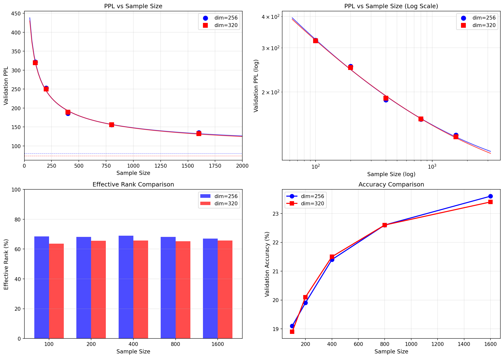

# Context Dim Comparison Analysis

**Date**: 2025-12-03
**Comparison**: context_dim=256 vs context_dim=320
**Device**: NVIDIA L4 (22.2GB)

## 実験結果

### context_dim=256

| Samples | Tokens | Val PPL | Val Acc | Effective Rank |
|---------|--------|---------|---------|----------------|
| 100 | 122,795 | 321.4 | 19.1% | 68.4% |
| 200 | 240,132 | 253.1 | 19.9% | 68.1% |
| 400 | 473,429 | 186.0 | 21.4% | 68.9% |
| 800 | 948,524 | 155.8 | 22.6% | 68.1% |
| 1600 | 1,920,992 | 134.7 | 23.6% | 67.0% |

### context_dim=320

| Samples | Tokens | Val PPL | Val Acc | Effective Rank |
|---------|--------|---------|---------|----------------|
| 100 | 122,795 | 319.9 | 18.9% | 63.6% |
| 200 | 240,132 | 250.1 | 20.1% | 65.5% |
| 400 | 473,429 | 189.0 | 21.5% | 65.8% |
| 800 | 948,524 | 156.0 | 22.6% | 65.2% |
| 1600 | 1,920,992 | 132.6 | 23.4% | 65.8% |

## PPL 比較

| Samples | dim=256 | dim=320 | Diff | % |
|---------|---------|---------|------|---|
| 100 | 321.4 | 319.9 | -1.5 | -0.5% |
| 200 | 253.1 | 250.1 | -3.0 | -1.2% |
| 400 | 186.0 | 189.0 | +3.0 | +1.6% |
| 800 | 155.8 | 156.0 | +0.2 | +0.1% |
| 1600 | 134.7 | 132.6 | -2.1 | -1.6% |
| **Average** | - | - | **-0.7** | **-0.3%** |

**結論**: PPL差はほぼなし（平均 -0.3%）

## Effective Rank 比較

| Samples | dim=256 (%) | dim=256 (abs) | dim=320 (%) | dim=320 (abs) | Abs Diff |
|---------|-------------|---------------|-------------|---------------|----------|
| 100 | 68.4% | 175.1 | 63.6% | 203.5 | +28.4 |
| 200 | 68.1% | 174.3 | 65.5% | 209.6 | +35.3 |
| 400 | 68.9% | 176.4 | 65.8% | 210.6 | +34.2 |
| 800 | 68.1% | 174.3 | 65.2% | 208.6 | +34.3 |
| 1600 | 67.0% | 171.5 | 65.8% | 210.6 | +39.0 |

**観察**:
- **割合**: dim=320 の方が低い（65% vs 68%）
- **絶対値**: dim=320 の方が高い（~210 vs ~175）
- 追加した64次元のうち、約35次元（55%）しか活用されていない

## 飽和モデル分析

飽和モデル: `PPL = PPL_min + A × n^(-a)`

| パラメータ | dim=256 | dim=320 | 差 |
|-----------|---------|---------|-----|
| **PPL_min** | 80.5 | 73.6 | -6.9 |
| A | 3167.7 | 2792.7 | -375.0 |
| a | 0.5575 | 0.5261 | -0.031 |
| R² | 0.9952 | 0.9982 | +0.003 |

### PPL_min の解釈

- dim=256: 理論的下限 ≈ 80.5
- dim=320: 理論的下限 ≈ 73.6
- **差**: わずか -6.9 (8.6% 改善)

context_dim を 25% 増やしても、PPL_min は 8.6% しか改善しない。

## 外挿予測

| Samples | dim=256 | dim=320 | Diff |
|---------|---------|---------|------|
| 3,200 | 115.7 | 113.6 | -2.1 |
| 6,400 | 104.4 | 101.4 | -3.0 |
| 10,000 | 99.1 | 95.6 | -3.6 |
| 50,000 | 88.1 | 83.0 | -5.1 |
| ∞ (PPL_min) | 80.5 | 73.6 | -6.9 |

**外挿でも差は小さい**: 10,000 samples でも 3.5 PPL 差程度

## 重要な発見

### 1. context_dim 増加の効果は限定的

```
PPL改善: 平均 -0.3%
PPL_min改善: -8.6%
```

context_dim を 256 → 320 (25% 増) にしても、現実的な改善は数%程度。

### 2. Effective Rank の効率低下

```
dim=256: ER = 68.1% (174次元を活用)
dim=320: ER = 65.2% (209次元を活用)
追加効率: 35次元 / 64次元 = 55%
```

追加した次元の約半分しか有効活用されていない。

### 3. ボトルネックの特定

PPL が context_dim にほぼ依存しないことから、**ボトルネックはモデル容量ではない**。

考えられるボトルネック:
1. **データ量**: より多くのデータが必要
2. **アーキテクチャ**: 1層の表現力の限界
3. **学習アルゴリズム**: Phase 1/2 の分離の影響

### 4. 実用的推奨

```
推奨: context_dim=256 で十分

理由:
- PPL差はほぼなし
- 計算コストが低い
- メモリ効率が良い
```

## グラフ



## 今後の検討事項

1. **データ量増加の効果**:
   - 3200, 6400 samples での追加実験
   - PPL_min に近づくか確認

2. **アーキテクチャ改善**:
   - Multi-block（カスケード連結）の検討
   - 2層構成の再検討

3. **Phase 1/2 分離の影響**:
   - End-to-end 学習との比較
   - Joint training の検討

## 結論

1. **context_dim=256 → 320 の効果は限定的**（PPL -0.3%）
2. **PPL_min の差も小さい**（80.5 → 73.6、8.6% 改善）
3. **ボトルネックは容量ではなく、データまたはアーキテクチャ**
4. **実用上は context_dim=256 で十分**
